# XML Project Backend Architecture

## Overview
This is a Spring Boot 3.1.3 application for managing XML, PDF, and Word documents with company-based access control and JWT authentication.

## Architecture Diagram

```mermaid
graph TB
    subgraph "Client Layer"
        WEB[Web Client]
        API[API Client]
    end

    subgraph "Spring Boot Application"
        subgraph "Controllers"
            AUTH[AuthController<br/>/api/user/auth]
            COMP[ControllerCompany<br/>/api/company]
            FILE[ControllerFile<br/>/file]
        end

        subgraph "Services"
            LOGIN[LoginService<br/>JWT Generation]
            USER_REPO[UserRepo<br/>User CRUD]
            UPLOAD[UploadFiles<br/>File Upload]
            LIST[ListFiles<br/>File Listing]
            DELETE[Delete<br/>File Deletion]
            DOWNLOAD[DownloadAll<br/>File Download]
            READ_WORD[ReadWordDocx<br/>Word Processing]
            READ_PDF[ReadPdf<br/>PDF Processing]
            GEN_DOC[GenerateDocument<br/>XML Generation]
        end

        subgraph "DTO Layer"
            AUTH_DTO[Auth DTOs]
            COMP_DTO[Company DTOs]
            FILE_DTO[File DTOs]
        end
    end

    subgraph "Database Layer"
        POSTGRES[(PostgreSQL<br/>xml_project)]
        FLYWAY[Flyway Migrations]
    end

    subgraph "File Storage"
        FILESYSTEM[Local File System<br/>~/xmlApp/uploads/]
    end

    subgraph "External Libraries"
        POI[Apache POI<br/>Word/Excel]
        ASPOSE[Aspose<br/>Document Conversion]
        PDFBOX[PDFBox<br/>PDF Processing]
        TIKA[Apache Tika<br/>Content Extraction]
        GROUPDOCS[GroupDocs<br/>Document Viewing]
        JWT[Auth0 JWT<br/>Authentication]
    end

    WEB --> AUTH
    API --> AUTH
    WEB --> COMP
    API --> COMP
    WEB --> FILE
    API --> FILE

    AUTH --> LOGIN
    AUTH --> USER_REPO
    AUTH --> AUTH_DTO

    COMP --> COMP_DTO

    FILE --> UPLOAD
    FILE --> LIST
    FILE --> DELETE
    FILE --> DOWNLOAD
    FILE --> READ_WORD
    FILE --> READ_PDF
    FILE --> GEN_DOC
    FILE --> FILE_DTO

    LOGIN --> USER_REPO
    USER_REPO --> POSTGRES
    UPLOAD --> POSTGRES
    LIST --> POSTGRES
    DELETE --> POSTGRES
    GEN_DOC --> POSTGRES

    FLYWAY --> POSTGRES

    UPLOAD --> FILESYSTEM
    LIST --> FILESYSTEM
    DELETE --> FILESYSTEM
    DOWNLOAD --> FILESYSTEM
    READ_WORD --> FILESYSTEM
    READ_PDF --> FILESYSTEM
    GEN_DOC --> FILESYSTEM

    READ_WORD --> POI
    READ_WORD --> ASPOSE
    READ_PDF --> PDFBOX
    READ_PDF --> ASPOSE
    GEN_DOC --> TIKA
    LOGIN --> JWT
```



## Component Details

### 1. Entry Point
- **XmlProjectApplication.java**: Spring Boot main class that starts the application

### 2. Controllers

#### AuthController (`/api/user/auth`)
- `POST /login`: User login with JWT token generation
- `POST /registration`: User registration with password hashing (SHA-256)

#### ControllerCompany (`/api/company`)
- `POST /auth`: Company authentication
- `POST /create`: Company creation with directory setup

#### ControllerFile (`/file`)
- `POST /upload`: Upload documents (Word, PDF, XML)
- `POST /list`: List files by company
- `GET /read`: Read Word documents
- `GET /read/split_words`: Read Word documents with word splitting
- `GET /read/XML`: Read and generate XML documents
- `GET /read/PDF`: Read PDF documents
- `GET /download/all`: Download all files
- `DELETE /delete/file`: Delete files
- `GET /xml/tables`: Get XML table data (currently disabled)

### 3. Services

#### Authentication Services
- **LoginService**: Generates JWT tokens using HMAC512 algorithm
- **UserRepo**: Handles user CRUD operations with SHA-256 password hashing

#### File Processing Services
- **UploadFiles**: Validates and uploads files to local storage
- **ListFiles**: Retrieves file lists from database
- **Delete**: Removes files from filesystem and database
- **DownloadAll**: Packages files for download
- **ReadWordDocx**: Processes Word documents using Apache POI
- **ReadPdf**: Extracts content from PDFs using PDFBox
- **GenerateDocument**: Parses XML structure and generates document data

### 4. Database Schema

#### Core Tables
- **users**: User authentication data
  - id (serial, PK)
  - username (text, unique)
  - password_hash (text)
  - info_person (text)

- **company**: Company management
  - id (serial, PK)
  - name_company (text, unique)
  - password_company (text)
  - desc_company (text)
  - owner_company (text)

- **files**: File metadata
  - id_file (serial)
  - file_name (text)
  - time_stamp (text)
  - author (text)
  - name_company (text)
  - type_file (text)

#### XML Object Tables (20+ tables)
- expert_organization_object_xml
- approver_object_xml
- examination_object_xml
- documents_object_xml
- previous_conclusions_object_xml
- object_object_xml
- declarant_object_xml
- project_documents_developer_object_xml
- finance_object_xml
- climate_conditions_object_xml
- climate_conditions_note_object_xml
- expert_project_documents_object_xml
- cadastral_number_object_xml
- experts_object_xml
- designer_object_xml
- summary_object_xml
- (and more...)

Each XML object table contains:
- Various field values (text)
- name_company (text)
- id_file (int)
- id_transaction (uuid)

### 5. File Storage Structure
```
~/xmlApp/uploads/
└── {company_name}/
    ├── file1.docx
    ├── file2.pdf
    └── file3.xml
```

### 6. Technology Stack

#### Core Framework
- Spring Boot 3.1.3
- Spring Web
- Spring Data JPA
- Spring JDBC

#### Database
- PostgreSQL
- Flyway (database migrations)

#### Authentication
- Auth0 JWT (java-jwt:4.2.2)
- jjwt-api:0.11.5

#### Document Processing
- Apache POI 5.2.0 (Word/Excel)
- Aspose Words 23.1
- Aspose PDF 23.1
- PDFBox 3.0.0-alpha2
- Apache Tika 2.5.0
- GroupDocs Viewer 17.5.0
- docx4j-core 8.2.9

#### API Documentation
- SpringDoc OpenAPI 2.6.0

#### Utilities
- Lombok (code generation)
- Jackson (JSON processing)
- Commons IO

## Data Flow

### User Authentication Flow
1. Client sends login request to `/api/user/auth/login`
2. AuthController validates credentials via UserRepo
3. LoginService generates JWT token
4. Token returned to client for subsequent requests

### File Upload Flow
1. Client sends file to `/file/upload` with company info
2. UploadFiles validates file type and checks for duplicates
3. File saved to `~/xmlApp/uploads/{company_name}/`
4. File metadata stored in database
5. Success response with filename list

### XML Document Processing Flow
1. Client requests XML data via `/file/read/XML`
2. GenerateDocument reads XML structure from JSON config
3. Parses XML file from filesystem
4. Extracts data into appropriate database tables
5. Returns structured data to client

### Company Creation Flow
1. Client sends company data to `/api/company/create`
2. ControllerCompany creates directory in filesystem
3. Company record inserted into database
4. Success response returned

## Security Considerations

- Passwords hashed with SHA-256 before storage
- JWT tokens for authentication (12-hour expiration)
- Company-based file isolation
- File type validation (only .doc files accepted for upload)
- Cross-origin requests allowed (`@CrossOrigin("*")`)

## Configuration

### Database
- URL: jdbc:postgresql://localhost:5432/xml_project
- Username: postgres
- Password: user
- Encoding: UTF-8

### File Paths
- Upload directory: `~/xmlApp/uploads/`
- XML structure config: Hardcoded absolute paths (needs refactoring)

## Known Issues

1. Hardcoded absolute file paths for XML structure data
2. Security: JWT secret hardcoded in LoginService
3. File upload path hardcoded for Linux (`/home/georgii/Загрузки/uploads/`)
4. Many XML table endpoints commented out in ControllerFile
5. Cross-origin allowed for all origins (`@CrossOrigin("*")`)
6. No Spring Security enabled (commented out in build.gradle)
